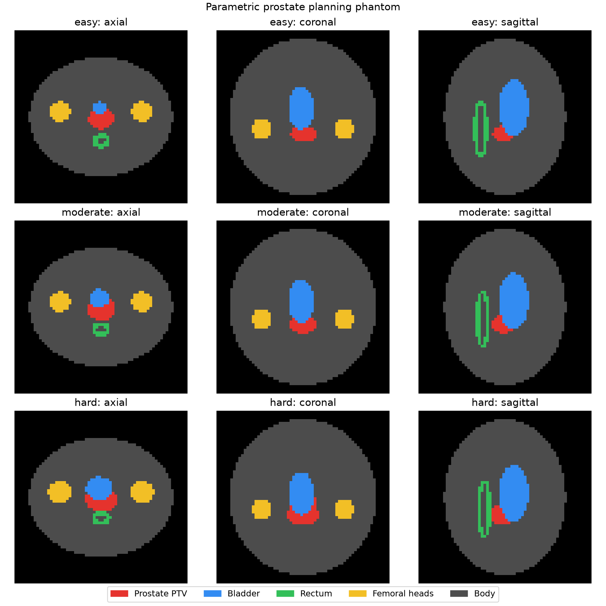
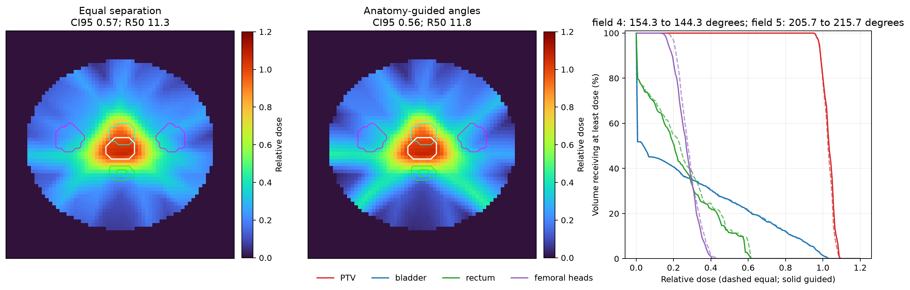

# Learning high-level radiotherapy planning and failure-handling decisions from expert trajectories: a controlled simulation study

**Article type:** Research Article (protocol-stage manuscript)

**Short title:** Planning trajectory supervision

**Authors:** David Thomas, [additional authors]

**Affiliations:** [To be completed]

**Corresponding author:** David Thomas, [postal address and e-mail]

**Author contributions:** [To be completed before submission using the CRediT taxonomy.]

**Conflict of interest statement:** [To be completed before submission.]

**Funding:** [To be completed before submission.]

**Acknowledgments:** [To be completed before submission.]

\pagebreak

# Abstract

**Background:** Knowledge-based planning and dose-prediction methods learn principally from approved plans and final dose distributions. These endpoints do not preserve the sequence of beam-geometry, target-structure, and optimization-priority changes used to obtain an acceptable plan. They also do not show when a planner accepts a justified variation or sends an unresolved trade-off for physician review. It is therefore unknown whether planning trajectories provide useful supervisory information beyond the final plan and disposition.

**Purpose:** To determine, in a controlled three-dimensional simulation, whether supervision from intermediate high-level planning and failure-handling decisions improves learned planning performance relative to supervision from matched final plans and dispositions alone.

**Methods:** Synthetic cases will contain one target, one to three organs at risk (OARs), a body contour, a prescription, and case-specific planning limits. Dose will be computed with a deterministic differentiable surrogate that maps beam fluence to a three-dimensional dose field. Planning will be represented by two nested processes. An automated inner optimizer will determine beamlet fluence for fixed beam angles, target structures, and objective priorities. A manual-level outer process will modify only beam angles, target structures, or target, hot-spot, named-OAR, and normal-tissue priorities. Terminal states will be classified as per protocol, acceptable target variation, acceptable OAR variation, requiring physician review, or technical failure. Repeated nonresponsive actions will not be used as expert labels. The primary experiment will compare two policies with identical architecture, cases, initialization, final plans and dispositions, training budget, and inference budget. The endpoint-only policy will receive loss terms derived from the final demonstration plan and disposition. The trajectory-supervised policy will receive the same terminal losses plus intermediate state and action targets. Ten independent training seeds will be evaluated on fixed in-distribution and out-of-distribution test sets. The primary endpoint will be paired normalized objective regret relative to a fixed reference optimizer. Secondary endpoints will include acceptable-plan rate, correct escalation, unsafe acceptance, target and OAR metrics, sample efficiency, number of high-level actions, and inference time.

**Results:** [To be completed after the environment, demonstration generator, model specification, and analysis code have been frozen. The abstract will report the paired mean difference in normalized regret with a 95% confidence interval, seed-level replication, acceptable-plan risk difference, out-of-distribution performance, and computational cost.]

**Conclusions:** [To be completed after the prespecified analysis. A favorable result will support the presence of useful supervisory information in high-level planning and failure-handling trajectories within this synthetic environment. A null result will indicate that the evaluated trajectory representation did not improve performance beyond matched terminal-plan and disposition supervision. Neither result will establish clinical efficacy.]

**Keywords:** radiation treatment planning; inverse planning; process supervision; imitation learning; knowledge-based planning; synthetic data

# 1. Introduction

Radiation treatment planning is a sequential decision process. A planner selects or revises beam geometry, specifies target and OAR priorities, reviews the optimized dose distribution, and modifies the problem until the plan satisfies clinical and technical requirements. The approved plan preserves the terminal beam configuration, fluence, and dose, but it generally does not preserve rejected configurations, intermediate dose distributions, or the order in which planning priorities were revised.

Knowledge-based planning and learned dose prediction have demonstrated that prior approved plans contain substantial information about the relationship between anatomy and achievable dose.1–4 These methods commonly estimate dose-volume objectives, predict three-dimensional dose, or produce a terminal plan from patient geometry. Their training targets are predominantly final products. Consequently, an endpoint dataset cannot directly identify which intermediate observations prompted a planner to change an OAR priority, alter target coverage emphasis, or revise beam geometry. The missing information may be redundant with the endpoint, or it may constrain the planning policy in a manner that improves generalization and reduces the number of examples required for training.

This distinction can be tested without acquiring clinical trajectories. A synthetic environment permits exact control over the case distribution, final demonstration plans, state representation, action vocabulary, optimization budget, and evaluation function. It also permits paired construction of two data views from the same demonstrations: an endpoint view containing the initial problem and final accepted plan, and a trajectory view containing the same information plus the intervening states and high-level actions. The resulting comparison isolates the contribution of intermediate supervision more directly than a comparison between unrelated planning systems.

The study is designed to answer one question: when final demonstration plans and terminal dispositions are held constant, does supervision from intermediate planning states and high-level decisions improve action selection, acceptable-trade-off recognition, safe escalation, and final plan quality relative to terminal-only supervision? The experiment does not evaluate a treatment planning system for clinical use. The dose operator, anatomy, constraints, and planner are synthetic. The intended inference is limited to whether the specified trajectory representation contains measurable information beyond matched endpoints in a controlled planning problem.

# 2. Materials and Methods

## 2.A. Study design and prespecified hypothesis

This will be a paired simulation study. Each generated case will have one initial planning state, one retained demonstration trajectory, and one final demonstration plan. Two training views will be derived from that record. The endpoint-only condition will expose the case, initial state, and final plan. The trajectory-supervised condition will expose these same data and the ordered intermediate state-action transitions. The primary learners will have the same architecture, parameter count, initialization schedule, rollout limit, final-state losses, and training-compute budget.

The prespecified primary hypothesis is that the trajectory-supervised policy will have lower mean normalized objective regret than the endpoint-only policy on the fixed in-distribution test set. Four conditions will be required for a favorable primary interpretation: the 95% confidence interval for the paired mean regret difference must exclude zero in favor of trajectory supervision; the direction of improvement must occur in at least eight of ten training seeds; acceptable-plan rate must not decrease; and either out-of-distribution regret or sample efficiency must improve without a material increase in inference cost.

## 2.B. Synthetic case generation

The primary synthetic cohort will represent prostate radiotherapy. Each case will be defined on a cubic voxel grid and will contain a pelvic body mask, a prostate/CTV, a PTV, a bladder, a whole-rectum contour, and separate left and right femoral-head shapes. The prostate/CTV will be generated before the normal structures. Bladder and rectum voxels that intersect the prostate/CTV will be removed so that the normal-organ contours abut but do not overlap the clinical target. A 5-mm expansion of the prostate/CTV will form the PTV.12 Therefore, target–OAR overlap will occur only in the PTV margin shell. A 3-mm posterior margin was evaluated but was not used because it was smaller than one voxel on the 64 × 64 × 64 grid and produced resolution-dependent rectum-overlap counts. The two femoral heads will share one named priority group so that the action vocabulary remains matched to the three-OAR generic development environment. The parameterized generator will vary body dimensions, prostate and target dimensions, bladder filling, rectal dimensions, femoral-head position, target–OAR separation, and PTV-margin overlap. Hard cases will include a superior seminal-vesicle-like target extension and restricted usable beam angles. Invalid geometries, including structures outside the body, clinical-target overlap with an OAR, and targets below a minimum volume, will be rejected before trajectory generation.

The prostate development and primary synthetic grid will contain 64 × 64 × 64 voxels. The policy image encoder will receive 32 × 32 × 32 resampled channels. Each field will use a 32 × 32 fluence map. Each manual-planning episode will start from seven fixed coplanar fields at approximately equal angular separation. The primary experiment will not include beam-angle changes. Earlier anatomy-only angle rules did not predict dosimetric improvement with adequate reliability. Beam-angle selection will remain a separate prespecified experiment after the target-structure and priority task passes. Noncoplanar actions will not be included in the primary experiment.

The clinical-anatomy planning test will use planning CT and RTSTRUCT data from the Prostate Anatomical Edge Cases collection in The Cancer Imaging Archive.9 The collection contains 131 subjects, including 112 anatomical edge cases and 19 normal cases. The prostate contour will receive an isotropic 5-mm expansion to form a PTV-like target. The bladder, rectum, and bilateral femoral-head contours will be mapped to the same three OAR priority groups used in the synthetic prostate cohort. The RTSTRUCT does not contain an external body contour. A CT threshold will therefore define the body mask, and CT image geometry will define contour placement. The importer will require the DICOM PatientPosition value HFS and the standard axial ImageOrientationPatient value. It will map the DICOM posterior-positive row direction to an anterior-positive planning y axis. Axial figures will use the radiological display convention, with anterior at the top and patient right at image left. The contour field of view will be padded in physical coordinates and resampled to 64 × 64 × 64 voxels. Each field will use a 32 × 32 fluence map. CT Hounsfield units will not modify dose deposition in this water-equivalent phase. DICOM-derived masks will be cached by subject, grid size, PTV margin, and importer version. Each subject will undergo automated checks for required contours, nonempty masks, structures outside the body, and prostate/CTV overlap with an OAR. Subjects with missing required contours will be excluded with the source defect recorded. Subjects with prostate/CTV-OAR overlap will be assigned to a separate anatomical edge-case analysis. The primary clinical-anatomy cohort will require overlap to be confined to the PTV margin.

Cases will be assigned to easy, moderate, and hard strata. Easy cases will have separated PTV and OAR volumes. Moderate cases will contain close proximity or limited PTV-margin overlap. Hard cases will contain greater PTV-margin overlap, three competing OARs, or restricted beam-angle subsets. The hard stratum will include a prespecified OAR-stress subset selected from target-OAR overlap before dose optimization. The stress subset will contain equal numbers of bladder-contact and rectum-contact cases. The two structures will use separate minimum overlap fractions because their volumes and PTV contact surfaces differ. PTV overlap with bladder and rectum is a recognized determinant of achievable OAR dose in prostate planning.13 Cases in which any selected OAR overlaps more than 20% of the PTV will be labeled geometric conflicts and excluded before dose calculation. Any case with prostate/CTV overlap with an OAR will also be excluded. This anatomy-only rule will preserve OAR-priority decisions without creating a direct contradiction between clinical-target coverage and OAR sparing. Geometry parameters, overlap stratum, random seed, generator version, planning goals, and all rejection reasons will be stored.

## 2.C. Three-dimensional dose surrogate

For beam b, the fluence map x_b(u,v) will be sampled in beam’s-eye coordinates after rotating each body voxel into the coordinate system of the beam. Bilinear interpolation in the fluence plane, multiplication by a deterministic depth-attenuation term, and summation over active beams will produce the dose field d(r):

d(r) = Σ_b m_b K_b[x_b](r),

where m_b is the binary active-beam indicator and K_b is the linear beam operator. A mathematically matched adjoint K_b* will propagate a voxelwise objective gradient to the fluence pixels. Forward–adjoint consistency will be verified numerically by the inner-product identity ⟨Kx,y⟩ = ⟨x,K*y⟩.

The operator will be evaluated implicitly; a dense voxel-by-beamlet influence matrix will not be stored. At 96³ resolution with 12 beams and 16 × 16 fluence pixels per beam, a dense float32 matrix would require approximately 10.1 GiB for one case. The implicit representation permits batched execution while maintaining float32 accumulation for plan metrics. The model approximates spatial deposition and attenuation but does not represent clinical radiation transport, heterogeneity correction, multileaf collimator mechanics, or deliverability.

## 2.D. Objective function and plan acceptability

For fixed planning priorities w, the automated optimizer will minimize

J(x;w) = w_cov L_cov + w_overlap L_overlap + w_hot L_hot + Σ_k w_OAR,k L_OAR,k + w_N L_N + w_F ||x||_2^2,

where L_cov combines the prostate V60 Gy and PTV V57 Gy coverage objectives with voxelwise underdose terms on the active full-dose optimization target. The initial active target is the full PTV. A recorded manual action may replace it with the union of the prostate/CTV and the PTV after subtraction of a named overlapping OAR. The prostate/CTV cannot enter the relaxed overlap mask. When this action is active, L_cov changes the full-PTV V57 Gy objective from at least 99% to at least 95%. It does not apply a separate minimum dose to every overlap voxel. Published prostate planning methods have used a full-dose PTV-minus-OAR structure with a lower minimum-dose objective for the overlap region.14 L_hot penalizes PTV dose above 63 Gy while excluding the hottest physical 1 cm³ from the penalty calculation, consistent with the D1cc evaluator. L_OAR,k represents the supplied rectum, bladder, and femoral-head dose-volume objectives. L_N contains a squared normal-tissue excess-dose term above 50% of prescription, a normal-tissue integral-dose term, and a high-dose normal-tissue term above 95% of prescription. Their development weights will be 50, 2, and 150, respectively. The PTV hotspot and clinical dose-volume base weights will be 20 and 2. Planner-controlled priorities will multiply the corresponding fixed terms. A small fluence-magnitude penalty will control numerical scale.

The current calibration template uses 1000 Adam iterations, a learning rate of 0.02, and 64 × 64 fluence pixels for each field. The fluence will be normalized to prostate D99 = 60 Gy before the first 100-iteration stage and after each stage. The adaptive optimizer state will be reset after each normalization. A final normalization will be applied before review. The PTV D1cc planning objective is 60 Gy with a base weight of 50; the clinical evaluator remains 63 Gy. This optimizer buffer is recorded as a planning parameter and is not an acceptance rule. The procedure fixes the dose scale against the prostate V60 Gy objective. The objective and every component will be recomputed from saved records as a validation check. These optimizer settings will be frozen only after the clinical-anatomy calibration set is complete.

The prostate experiment will use a prescription of 60 Gy in 20 fractions, or 3 Gy per fraction. The active clinical evaluator is the institutional objective set approved in December 2023. It requires prostate V60 Gy at least 99%, PTV D99 at least 57 Gy, and PTV D1cc at most 63 Gy. Rectal objectives are V37 Gy at most 50% and V46 Gy at most 30%. Bladder objectives are V37 Gy at most 50% and V46 Gy at most 30%. The separate left and right femoral-head objectives are V43 Gy at most 5%. The source table assigns priority 1 to prostate, rectum, and bladder objectives; priority 2 to PTV objectives; and priority 3 to femoral-head objectives. It specifies no variation limits. The two femoral heads remain one manual planning-priority group but are evaluated separately. PTV D1cc will be calculated from physical voxel volume. PTV D98, D50, and D2 will be reported as diagnostics only.

Per-protocol acceptance will require all nine institutional objectives, a 57 Gy covering-isodose-volume to PTV-volume ratio no greater than 1.10, and the fixed seven-field representation. A separate acceptable-variation category will be used for target-OAR conflicts. PTV V57 Gy can decrease from at least 99% to at least 95% only when all institutional OAR limits pass. Rectum or bladder volume can exceed an institutional volume limit by no more than 5 percentage points only when standard target coverage passes. Prostate V60 Gy at least 99%, PTV D1cc at most 63 Gy, femoral-head limits, and conformity will not be relaxed. Simultaneous target and OAR variation will require physician review and will not be accepted automatically. This quantitative policy adapts the PERYTON 60 Gy in 20 fractions variation ranges. It is consistent with PACE guidance that permits limited PTV undercoverage at rectal overlap. The original prostate and PTV remain unchanged for evaluation. Paddick conformity index, R50, PTV D98, PTV D50, and PTV D2 will remain descriptive secondary metrics. These criteria define acceptability within the research dose surrogate. They do not establish that a plan is suitable for patient treatment.

## 2.E. Nested planning process

The simulator separates automated numerical optimization from recorded manual-level planning. For fixed active beam angles and fixed priority values, the inner optimizer updates all active fluence maps with the Adam algorithm. Nonnegative fluence is enforced after every update. Periodic target normalization and all fluence updates are inner-optimizer operations. They are not planning actions, are not exposed as behavior labels, and will not be counted as trajectory length.

After the inner optimizer has completed 1000 iterations, the outer process reviews the optimized state. The optimizer uses a 64 by 64 fluence map for each of seven fixed fields and an Adam learning rate of 0.02. A state contains anatomy masks, prescription and limits, active beam indicators, active optimization-target masks, target and OAR priority values, optimized dose, fluence, prostate V60 Gy, PTV D99, PTV D1cc, each OAR dose-volume value, the 57 Gy covering-isodose ratio, diagnostic dose metrics, violation maps, action history, and remaining action budget. The high-level action vocabulary is restricted to the following operations:

1. create a PTV-minus-bladder or PTV-minus-rectum optimization target while retaining the prostate/CTV in the full-dose target;
2. increase target-coverage priority;
3. increase target hotspot priority;
4. increase the priority of one named OAR;
5. increase normal-tissue priority; or
6. stop and accept the current plan, permitted only when all acceptance criteria are satisfied.

The 15-patient development calibration will use four starting profiles assigned before dose optimization: balanced reference, guarded OAR stress, hotspot stress, and conformity stress. The balanced profile sets all planner-controlled priorities to 1.0. Each stress profile sets target priority to 3.0. The OAR, hotspot, and normal-tissue priorities are 0.10, 0.04, and 0.02, respectively. These values were selected in the development set to produce near-limit initial failures without exceeding the fixed severity bounds. If the related clinical metric fails, the reviewer increases the active priority by a factor of 3.0. The maximum priority is 7.59375, and the maximum number of manual changes is eight. These starting states and changes are high-level planning settings. They are not selected by an optimizer search.

The locked clinical-anatomy evaluation will exclude all 15 development patients. Each of the remaining 101 patients will receive one starting profile. The fixed allocation is 10 balanced reference, 21 guarded OAR, 35 hotspot stress, and 35 conformity stress. Profile counts are allocated proportionally within the margin-only and interface-overlap anatomy strata. Within each stratum, profiles are distributed across ranked maximum PTV-OAR overlap. The assignment manifest is created before validation dose calculation and cannot be changed after the run starts.

Before a weight or target-structure change, the reviewer will calculate geometry-only lower bounds for each OAR volume objective under both permitted variation paths. The bound accounts for OAR volume inside the PTV, OAR volume inside the prostate, and the cold-voxel counts permitted by prostate V60 and PTV V57. A major anatomical objective conflict is recorded only when neither the target-variation path nor the OAR-variation path is geometrically possible. For other cases, the reviewer first determines whether a named OAR-priority increase can reach the acceptable OAR-variation limit while standard target coverage is retained. If this path does not pass, the reviewer creates the corresponding PTV-minus-OAR optimization target and permits PTV V57 Gy to decrease to 95%. This action is based on visible anatomy and the failed DVH. It is not selected by an optimizer search. The reviewer then calculates the relative deviation from each failed clinical limit. The largest relative deviation is treated first. Ties use a fixed order. A priority at its ceiling is skipped so that the reviewer can act on the next failed objective. A plan that fails the hotspot criterion receives a hotspot-priority increase, not a target-priority increase. A plan that fails an OAR goal after target separation receives an increase to that named OAR priority. A plan that fails only conformity receives a normal-tissue-priority increase. Each plan is recalculated from the same fluence initialization after a manual change. This removes optimizer warm-start history from comparisons between manual settings.

The response to each manual action is measured before another action of the same class is selected. A target-priority action must increase PTV V57 Gy by at least 1 percentage point. A hotspot-priority action must reduce PTV D1cc by at least 0.3 Gy. An OAR-priority or PTV-minus-OAR action must reduce the relevant OAR volume by at least 1 percentage point or by at least 10% of the current excess, whichever is larger. A normal-tissue-priority action must reduce the 57 Gy covering-isodose ratio by at least 0.01. If two consecutive actions of the same class do not meet the applicable response threshold, that action class is stopped. The reviewer then changes strategy or records that physician review is required. The second repeated nonresponsive action and the complete affected episode are retained in the calibration record but are excluded from expert demonstration labels.

The procedure stops when the plan passes; it does not apply an additional change without a corresponding violation. A nonacceptable terminal plan is assigned to one of three groups: a correctable planning failure not reached within the action budget, a major target-OAR variation that requires physician review, or a technical failure. For a major variation, the record preserves a target-preserved state and an OAR-preserved state. It reports PTV V57 Gy and the worst OAR objective ratio for both states. It does not assign an automatic accept label. Thus, one retained trajectory transition represents one interpretable target-structure or priority change followed by automated reoptimization.

**Figure 1.** Nested planning process. Recorded supervision is confined to target-structure, target-priority, hotspot-priority, named-OAR-priority, and normal-tissue-priority decisions in the outer process. Fluence updates occur in the automated inner optimizer and are excluded from manual-action labels.

## 2.F. Demonstration generator and reference optimizer

A deterministic rule-based planner will provide an interpretable calibration baseline. It will select an action from the largest relative PTV, OAR, or conformity violation and will use deterministic tie breaking. It will not serve as the primary demonstration source.

Primary demonstrations will be generated by sequential review of dose planes, exact 57, 60, and 63 Gy isodose contours, cumulative DVHs for the prostate, PTV, bladder, rectum, and separate femoral heads, and a table that shows every active evaluator value and limit. The reviewer will select one permitted high-level action after each plan. The action and a short reason will be stored before the inner optimizer is rerun. A calibration set will be reviewed jointly with a medical physicist until the action rubric is frozen. Reviewer agreement and all disagreements will be reported. If no permitted action can produce an acceptable plan within eight changes, the terminal disposition will state whether the plan requires physician review, was not reached by the declared review rules, or failed for a technical reason. These labels will not be interpreted as proof of physical infeasibility. Repeated actions without a material response will not be used as expert demonstrations.

A separate continuous reference optimizer will estimate the best objective attainable under the fixed dose surrogate and case definition. It will provide the denominator for normalized regret and will identify demonstration plans that are materially inferior to the attainable solution. Learners will not be trained on the reference optimizer’s search history. A case will be retained only if its demonstration is acceptable and its terminal objective is within a frozen tolerance of the reference result.

**Figure 2.** Illustrative synthetic three-dimensional case shown in orthogonal planes. This figure documents the geometry representation and is not a study result.

**Figure 3.** Parametric prostate planning phantom in axial, coronal, and sagittal planes. The prostate PTV, bladder, whole rectum, and bilateral femoral heads are shown for easy, moderate, and hard settings. This figure documents the synthetic anatomy method and is not a learner result.

**Figure 4.** Clinical plan review interface. The upper row shows dose in three orthogonal planes with head-first supine orientation labels. White shows the PTV. Cyan, yellow, and red show the 57, 60, and 63 Gy isodose contours. The lower row shows cumulative DVHs for the prostate, PTV, bladder, rectum, and separate femoral heads; every active evaluator value and limit; the field angles; and the short review decision. This development example shows an anatomical objective conflict and is not a learner result.

**Figure 5.** Forty-eight representative cases from 116 valid imported TCIA prostate patients after physical padding and resampling to the planning grid. The PTV-like target was formed by applying a 5-mm margin to the prostate contour. The panels show head-first supine axial slices in the radiological display convention. Each panel gives explicit anterior, posterior, right, and left labels. Fifteen additional patients were excluded because a required source ROI contained no contour items. This figure documents the clinical-anatomy import and quality-control method and is not a learner result.

The source RTSTRUCT was inspected for each of the 15 exclusions. In each case, the required ROI name was present, but the corresponding ROIContourSequence contained zero contour items. The exclusions therefore reflect source contour omissions rather than a structure-name or rasterization error.

**Figure 6.** Negative development test of rule-based beam-angle refinement. A seven-field equal-separation plan is compared with the same plan after two 10-degree anatomy-guided field changes. Dashed and solid DVHs show the initial and revised plans. The rule reduced plan acceptance and was excluded from the primary experiment.

## 2.G. Dataset construction and partitioning

The planned dataset contains 10,000 valid cases: 7000 training cases, 1000 validation cases, 1000 in-distribution test cases, and 1000 out-of-distribution test cases. The in-distribution partitions will be stratified by difficulty. Partition assignment occurs before trajectory generation, and all records derived from a case remain in one partition. The existing split manifest has SHA-256 digest c9af78cd282846ee1410f9f688bbb3cb1b82294009560374e6b331310e269a2b.

The out-of-distribution partition will contain prespecified shifts in target–OAR overlap, OAR count, objective-weight distribution, and available beam angles. The precise parameter ranges will be frozen before generation. Nested training subsets of 100, 250, 500, 1000, 2500, 5000, and 7000 cases will be used for the sample-efficiency analysis.

Each record will contain case identity, generator and optimizer versions, random seeds, geometry parameters, fixed starting profile, initial state, ordered high-level transitions, response to each action, final demonstration state, terminal disposition, reference result, stopping reason, and per-state quality metrics. The endpoint data loader will be tested to ensure that intermediate states and actions cannot be accessed. Major variations and repeated nonresponsive actions will remain in the audit dataset but will not receive expert action labels.

A 101-patient TCIA planning evaluation will precede the large synthetic computation. It will use all 101 unique valid patients not used for development. It will not add duplicate or synthetic patients. The analysis will use two prespecified strata. The margin-only stratum will require zero prostate/CTV overlap with bladder and rectum on the 64 × 64 × 64 planning grid. The interface-overlap stratum will retain valid anatomical edge cases with rasterized prostate/CTV-OAR overlap. Excluded and failed cases will remain in the audit record.

PortPy will provide a planned external dose-model and deliverability study. The current public release contains 129 prostate patients with CT, contours, 72 candidate beam directions, Eclipse-derived dose-influence matrices, expert-selected beams, and ECHO IMRT and VMAT reference plans. The implementation will first reproduce the supplied dose and DVH for one patient. A prespecified 20-patient integration cohort will then test structure mapping, objective mapping, dose reconstruction, and review outputs. These patients will not enter the external performance estimate. The remaining 109 patients will form a locked external evaluation cohort. Expert-beam data will be used for the first study. The full 72-beam data will be reserved for the beam-angle and VMAT analyses because one complete patient requires approximately 7.6 GB.

If controlled anatomy variants are used in the large training dataset, all variants from one source patient will remain in one partition. The source patient, rather than the variant, will remain the statistical unit. The prostate/CTV and OAR deformations will use frozen magnitude limits. The PTV will be recalculated from the changed prostate/CTV. A variant will be rejected if it creates a disconnected structure, a structure outside the body, or an undeclared prostate/CTV-OAR overlap.

## 2.H. Learned planning policies

The primary model will be an iterative policy πθ(a_t|c,s_t), where c denotes fixed case data and s_t denotes the current optimized planning state. A three-dimensional convolutional encoder will process structure masks, dose, and violation maps. A multilayer perceptron will process scalar metrics, priority values, active-beam indicators, and remaining action budget. The representations will be combined to score all legal high-level actions. Illegal actions, including removal of an inactive beam or reduction below a priority bound, will be masked identically in both conditions.

The endpoint-only policy will be unrolled for the same number of high-level steps as the trajectory-supervised policy. Its action policy will be optimized from rewards computed only after terminal simulator rollout; the reward will combine plan acceptability, capped terminal constraint violation, and a small action-count penalty. Its auxiliary terminal loss will predict final high-level planning settings. No intermediate demonstration state or action will be available to this condition.

The trajectory-supervised policy will use the identical network, terminal rollout reward, auxiliary terminal loss, legal-action mask, and rollout limit. It will additionally receive categorical action loss at each demonstration state and, if retained after the model pilot, a next-state dose-change loss. The relative trajectory-loss coefficient was selected using the validation partition and fixed at 0.20 before test evaluation. During rollout, the stop action will be masked until the current plan satisfies the same visible acceptance criteria used to label demonstrations. Both policies will use equal numbers of auxiliary pretraining and terminal-rollout updates. A complementary equal-label analysis will subsample trajectory targets to separate temporal information from target count.

## 2.I. Comparators and ablations

The principal comparison is trajectory-supervised versus endpoint-only iterative planning. Contextual comparators will include the unmodified initial plan, a direct endpoint regressor, the rule-based high-level planner, the demonstration search procedure, and the continuous reference optimizer.

Prespecified ablations will evaluate action labels without next-state targets, intermediate-state targets without action labels, shuffled trajectory order, retention of every second, fifth, or tenth action, 5%, 10%, and 20% suboptimal-action contamination, multiple near-optimal demonstrations, equal optimizer updates, equal numbers of labeled targets, and removal of violation maps. A delivery-complexity analysis will compare the primary seven-field static representation with 180-degree and 360-degree arc-like angular sampling. These arc-like conditions will assign an independent fluence map to each control point and therefore will not be described as delivery-realistic VMAT; they omit MLC-aperture continuity, cumulative monitor units, dose-rate modulation, and gantry-speed constraints. Shuffled-order and equal-compute analyses will be performed irrespective of the primary result because they are required to distinguish temporal information from additional supervision or computation.

## 2.J. Outcomes

The primary endpoint will be normalized objective regret for model q on case i:

R_iq = [J_iq − J_i,ref] / max(|J_i,ref|, ε),

where J_i,ref is the fixed reference objective and ε prevents numerical instability near zero. The primary effect estimate will be the paired case-level difference R_i,traj − R_i,end. Negative values favor trajectory supervision.

Secondary outcomes will be acceptable-plan rate; prostate V60 Gy; PTV D99 and D1cc; covering-isodose ratio and Paddick conformity index at 57 Gy; each OAR dose-volume ratio and violation magnitude; number of high-level steps to acceptability; accepted objective improvement per action; inference time; and number of dose evaluations. Safety outcomes will be correct terminal-disposition rate, correct escalation rate for major variations, unsafe acceptance rate, fraction of correctable failures rescued, and number of unnecessary or repeated nonresponsive actions. PTV D98, D50, and D2 will be diagnostic outcomes. Sample efficiency will be summarized with learning curves and the number of endpoint-only cases required to match the trajectory-supervised policy trained on 1000 cases.

## 2.K. Statistical analysis

The test case will be the unit of analysis. Both policies will be evaluated on identical cases, and all effect estimates will be paired. Ten model-initialization seeds will be used for each primary condition. Continuous outcomes will be summarized by mean, median, interquartile range, and 95% confidence interval. A hierarchical bootstrap will resample training seeds and cases to obtain confidence intervals that reflect both sources of variation. The acceptable-plan endpoint will be reported as a paired risk difference with a 95% confidence interval.

The single prespecified primary comparison will not receive a multiplicity adjustment. Secondary and ablation comparisons will be controlled with the Benjamini–Hochberg false-discovery-rate procedure. Exact confidence intervals and effect sizes will be reported with P values. Failed runs, search failures, nonfinite values, and all exclusions will remain in the analysis manifest.

No formal power calculation is available for the synthetic effect because a defensible variance estimate does not yet exist. The 1000-case in-distribution test set provides narrow case-level uncertainty for moderate paired effects, whereas ten training seeds characterize training variability. Before the main run, a 300-case learner pilot confined to training and validation partitions will estimate variance and produce a blinded precision analysis without testing the primary hypothesis. Dataset size will not be reduced on the basis of favorable interim effects.

## 2.L. Validation gates and criteria for initiating the main computation

The main 10-seed experiment will begin only after four gates have been satisfied. Environment validation requires dose nonnegativity, forward–adjoint agreement, exact transition replay, objective reproduction, monotonic responses to controlled priority changes, and seed-level reproducibility. Demonstration validation requires at least 95% acceptance among retained in-distribution cases, a frozen demonstration-to-reference tolerance, and documented stopping reasons. In the starting-profile development set, at least 90% of balanced-control plans must be initially acceptable and 40% to 80% of stress-profile plans must fail initially. At least 90% of all final plans must be acceptable, the median corrected trajectory must contain one to four actions, and more than one action class must be present. Initial development states must also have PTV D1cc no greater than 70 Gy, a 57 Gy covering-isodose ratio no greater than 1.25, a worst OAR objective ratio no greater than 1.50, and PTV V57 Gy of at least 90%. These are development-severity limits and are not clinical acceptance criteria. Comparison validation requires identical partitions, seed schedules, parameter counts, action masks, rollout limits, and compute budgets, together with an automated proof that the endpoint loader does not expose intermediate records. Reporting validation requires regeneration of every figure from a single per-case results table and retention of failed runs.

An initial 300-case dataset and model pilot will precede the full computation. Progression will require successful overfitting of 32 cases by both learners, stable optimization without nonfinite losses, a measurable range of case difficulty, acceptable throughput on the available hardware, and completion of all comparison-integrity tests. Failure of a gate will trigger revision and regeneration of pilot data; it will not trigger expansion to the full dataset.

## 2.M. Computational implementation and reproducibility

The current verification suite contains 53 passing tests. The chronological development record below retains the smaller test count that was current at its earlier checkpoint.

The dose operator and learned models will be implemented in Python and PyTorch. Independent cases will be distributed across four NVIDIA A100 graphics processing units for dataset generation and training. Mixed-precision beam calculations may use float16 or bfloat16, while objective accumulation and reported metrics will use float32. Configuration files, package versions, source-control commit, random seeds, dataset hashes, checkpoints, and per-case outputs will be archived. Unit tests will cover geometry, forward and adjoint operators, NumPy–PyTorch agreement, inactive-beam masking, action transitions, objective components, serialization, and data-view separation.

The current local implementation has completed engineering verification from 64 × 64 × 64 through 256 × 256 × 256 resolution and passes 43 automated tests with a CUDA backend. A deterministic 32-case development run verified the matched iterative-policy implementation and exact repeatability of its serialized case metrics. A subsequent 300-case validation-stage pilot used a compact multilayer perceptron with scalar metrics and centroid-based geometry features. A one-seed development run then tested a matched 93,476-parameter three-dimensional image-plus-scalar policy on 24 training and 60 validation cases. The endpoint-only and trajectory-supervised acceptable-plan rates were 0.467 and 0.583, respectively; this validation-stage result was used only to verify the image path and does not enter the planned hypothesis test. The prostate generator produced 300 valid seeded anatomies. The retained prostate development dataset contains 240 training and 60 validation cases selected from 322 attempts. Easy, moderate, and hard retention rates were 1.000, 1.000, and 0.794. A five-seed prostate image-policy development run used 24 training and 60 validation cases. Endpoint-only and trajectory-supervised acceptable-plan rates were 0.757 and 0.700. The paired difference was -0.057, with a hierarchical-bootstrap 95% confidence interval from -0.170 to 0.047. Mean violation scores were 0.0574 and 0.0422. Trajectory supervision reduced hard-case violation but reduced moderate-case acceptability. All 25 failed moderate-case trajectory rollouts with recorded action sequences reached the ten-action limit; 20 repeatedly increased the femoral-head and hot-spot priorities. A subsequent one-seed calibration used all 240 training cases. Endpoint-only and trajectory-supervised acceptable-plan rates were 0.767 and 0.833, and mean violation scores were 0.0625 and 0.0243. The trajectory model accepted all 22 moderate cases and 5 of 15 hard cases, compared with 21 and 2 for the endpoint model. The run required 1429.8 s and 7119 MB of peak CUDA memory. Paired review records contain dose images, target and OAR metrics, beam angles, priorities, and all high-level actions. A 15-case hard-cohort calibration accepted every case with review-triggered target and hot-spot priority changes. An anatomy-only beam-eye-view rule for 5- or 10-degree field shifts reduced plan acceptance in all three tested action schedules and was excluded from the demonstration generator. These development findings require replication across training seeds before the primary computation. The complete 131-patient TCIA collection was imported for the clinical-anatomy pilot. One hundred sixteen patients had nonempty required contours. Fifteen were excluded because one required source ROI contained zero contour items. Thirty-seven valid patients had zero prostate/CTV-OAR overlap on the 64 × 64 × 64 grid and formed the margin-only stratum. Seventy-nine patients formed the interface-overlap stratum. Eight of the first 11 margin-only plans passed the fixed seven-field, eight-change planning test. The 72.7% calibration pass rate is below the prespecified 95% demonstration-retention gate. A first 100-patient run was stopped after 13 complete patients and part of patient 14 because the importer had not converted the DICOM posterior-positive row direction to the planning anterior-positive y direction. That run is excluded. Importer version 2 corrected the orientation, regenerated all valid contour caches, and added patient-orientation labels. The corrected 100-patient priority-only baseline accepted 55 plans and failed 45. A subsequent development change added recorded PTV-minus-bladder and PTV-minus-rectum actions. One bladder case and one rectum case verified the new representation; the bladder case remained below the provisional overlap floor, and the rectum case passed after one target-structure action. Development and validation measurements are excluded from the planned hypothesis test. Formal computational results will be regenerated from the frozen version and reported in Section 3.

## 2.N. Scope and ethics

The primary learning experiment uses generated geometries and synthetic constraints. The clinical-anatomy pilot uses public deidentified CT and RTSTRUCT data from TCIA. The planned PortPy study uses public deidentified patient data and commercial-system-derived planning data under the dataset license. The study does not use clinical planning-session trajectories or identifiable patient information. Institutional review requirements will be confirmed before analysis beyond the terms of the public datasets. The present study will not support conclusions regarding patient safety or clinical deployment. The water-equivalent surrogate results will not be described as clinically deliverable plans.

# 3. Results

## 3.A. Environment and demonstration validation

[RESULTS PLACEHOLDER. Report Gate A test results; generated, rejected, search-failed, and retained case counts; acceptance rate with confidence interval; trajectory-length distribution; difficulty balance; and demonstration-to-reference objective difference. Insert the environment-validation table and representative non-result methods images only after the environment version is frozen.]

## 3.B. Primary in-distribution comparison

[RESULTS PLACEHOLDER. Report normalized regret for both conditions across 1000 paired cases and ten seeds; paired mean difference with hierarchical-bootstrap 95% confidence interval and P value; median paired difference; fraction of seeds favoring trajectory supervision; and the full distribution of case-level differences.]

## 3.C. Plan acceptability and dosimetric components

[RESULTS PLACEHOLDER. Report paired acceptable-plan counts and risk difference; prostate V60 Gy; PTV D99 and D1cc; 57 Gy covering-isodose ratio and Paddick conformity index; each rectum, bladder, and left and right femoral-head dose-volume value; violation magnitudes; diagnostic PTV D98, D50, and D2; and the number of cases improved, unchanged, or worsened.]

## 3.D. Sample efficiency

[RESULTS PLACEHOLDER. Report regret and acceptable-plan rate at 100, 250, 500, 1000, 2500, 5000, and 7000 training cases; area under the learning curves; and the endpoint-only sample count required to match the 1000-case trajectory model.]

## 3.E. Out-of-distribution evaluation

[RESULTS PLACEHOLDER. Report the primary and secondary outcomes for each frozen distribution shift, with separate estimates for increased overlap, additional OARs, shifted priorities, and restricted beam angles.]

## 3.F. Ablations and failure analysis

[RESULTS PLACEHOLDER. Report action-only, state-only, shuffled-order, sparse, noisy, diverse-demonstration, equal-update, equal-label, and hidden-rationale analyses. Describe failure modes by difficulty stratum without selecting examples solely by visual appearance.]

## 3.G. Clinical-anatomy and external dose-model evaluation

[RESULTS PLACEHOLDER. Report the full TCIA contour audit, exclusions, the 101-patient cohort composition, acceptance with a 95% confidence interval, PTV and OAR results, action counts, and separate margin-only and interface-overlap results. If the PortPy progression gate is completed, report dose-reconstruction agreement, the 20-patient integration result, and the comparison with ECHO IMRT and VMAT reference plans. Do not pool water-equivalent and Eclipse-derived dose results.]

## 3.H. Computational performance

[RESULTS PLACEHOLDER. Report dataset-generation throughput, training time, inference time, peak device memory, number of dose evaluations, hardware configuration, and total energy or device-hours if available.]

# 4. Discussion

This study is designed to isolate the value of ordered planning information from the value of a final plan. The two principal conditions use the same cases and terminal demonstrations, and differ only in access to intermediate optimized states and high-level beam or priority decisions. This control is essential because a comparison between independently generated endpoint and trajectory datasets would confound trajectory information with final-plan quality, case selection, or computational budget.

If the trajectory-supervised policy meets the prespecified criteria, the result will indicate that the ordered high-level decisions contain information that is not fully recovered from terminal dose and plan parameters by the evaluated endpoint learner. Improvement in the shuffled-order control would weaken this interpretation by indicating that additional targets, rather than their temporal order, explain the effect. Improvement that disappears in the equal-label or equal-update control would similarly identify supervision quantity or training computation as the operative factor.

A null result would remain informative. It could indicate that the final state is sufficient for the synthetic problem, that the state and action representation omits the relevant decision context, that the demonstration generator is too deterministic, or that the task lacks ambiguity requiring intermediate guidance. These alternatives will be examined through the diverse-demonstration, hidden-rationale, difficulty, and out-of-distribution analyses. A null result would not establish that clinical planning trajectories lack value; it would limit support for the present representation and task.

The study differs from conventional knowledge-based planning and dose prediction. Those approaches estimate achievable objectives or terminal dose from anatomy and prior plans.1–4 The present models instead select a sequence of explicit planning changes, while a fixed numerical optimizer determines fluence after each change. This separation places the learned decision at the level of named clinical priorities. It also prevents numerical optimizer iterations from being mischaracterized as manual behavior.

Sequential supervision introduces a distributional concern: errors early in a rollout change the states encountered later. General imitation-learning theory identifies this dependence as a source of compounding error when a policy is trained only on expert-visited states.5 The primary comparison therefore uses identical rollout budgets, and the failure analysis will distinguish action-classification accuracy at demonstration states from realized closed-loop planning performance. Dataset aggregation or recovery-state training may be evaluated subsequently, but it is not part of the primary contrast.

The principal limitation is the synthetic environment. The dose surrogate omits scattering physics, tissue heterogeneity, delivery constraints, machine limitations, and complete clinical judgment. The acceptance thresholds are clinically sourced, but their use with this surrogate does not establish clinical acceptability. The review procedure is an operational demonstration generator, not a complete model of a dosimetrist. Its failure denotes failure within an action budget rather than infeasibility. Furthermore, one terminal plan may not represent the full set of clinically acceptable solutions. The multiple-demonstration ablation partially addresses this nonuniqueness but cannot reproduce interplanner or interinstitutional variation.

Clinical translation would require a separate observational study in which planning states and actions are extracted from treatment planning sessions, linked to dose and plan revisions, reviewed for semantic validity, and evaluated under institutional governance. Every synthetic state element retained for that study would require a defined clinical source. Screen-observable variables and treatment-planning-system exports may differ in timing and precision. The present study can justify collection of this data modality only if a benefit remains after the matched-compute, matched-label, and shuffled-order controls.

# 5. Conclusions

[CONCLUSION PLACEHOLDER. State whether the prespecified primary criterion was met and identify the result as evidence confined to the frozen synthetic environment. Do not claim clinical benefit. If favorable, specify whether the benefit reflected final quality, acceptable-plan rate, sample efficiency, out-of-distribution performance, or action efficiency. If null, state the confidence interval and the effect sizes excluded by the experiment.]

# Data and code availability

Source code, frozen configurations, split manifests, dataset hashes, and analysis scripts will be made available at https://github.com/davidthomas411/planning-learner-sim. Generated data and model checkpoints will be deposited with the manuscript or in an archival repository, subject to file-size limitations.

# References

1. Momin S, Fu Y, Lei Y, et al. Knowledge-based radiation treatment planning: A data-driven method survey. J Appl Clin Med Phys. 2021;22(8):16–44. doi:10.1002/acm2.13337.

2. Fan J, Wang J, Chen Z, Hu C, Zhang Z, Hu W. Automatic treatment planning based on three-dimensional dose distribution predicted from deep learning technique. Med Phys. 2019;46(1):370–381. doi:10.1002/mp.13271.

3. Nguyen D, Jia X, Sher D, et al. 3D radiotherapy dose prediction on head and neck cancer patients with a hierarchically densely connected U-net deep learning architecture. Phys Med Biol. 2019;64(6):065020. doi:10.1088/1361-6560/ab039b.

4. Barragán-Montero AM, Nguyen D, Lu W, et al. Three-dimensional dose prediction for lung IMRT patients with deep neural networks: robust learning from heterogeneous beam configurations. Med Phys. 2019;46(8):3679–3691. doi:10.1002/mp.13597.

5. Ross S, Gordon GJ, Bagnell JA. A reduction of imitation learning and structured prediction to no-regret online learning. Proc Mach Learn Res. 2011;15:627–635.

6. Appenzoller LM, Michalski JM, Thorstad WL, Mutic S, Moore KL. Predicting dose-volume histograms for organs-at-risk in IMRT planning. Med Phys. 2012;39(12):7446–7461. doi:10.1118/1.4761864.

7. Moore KL, Brame RS, Low DA, Mutic S. Experience-based quality control of clinical intensity-modulated radiotherapy planning. Int J Radiat Oncol Biol Phys. 2011;81(2):545–551. doi:10.1016/j.ijrobp.2010.11.030.

8. Good D, Lo J, Lee WR, Wu QJ, Yin FF, Das SK. A knowledge-based approach to improving and homogenizing intensity modulated radiation therapy planning quality among treatment centers: an example application to prostate cancer planning. Int J Radiat Oncol Biol Phys. 2013;87(1):176–181. doi:10.1016/j.ijrobp.2013.03.015.

9. Prostate Anatomical Edge Cases. The Cancer Imaging Archive. Published 2023. doi:10.7937/QSTF-ST65.

10. NRG Oncology. Radiation Therapy Section: Protocol Prostate Treatment Template. Version 2.4. Updated 2025. Accessed August 10, 2026. https://www.nrgoncology.org/wp-content/uploads/2025/09/RT-section-Protocol-Prostate-Treatment-Template-update-v.2.4.2025-FINAL_updated.pdf.

11. Pryor DI, Turner SL, Tai KH, et al. Moderate hypofractionation for prostate cancer: A user's guide. J Med Imaging Radiat Oncol. 2018;62(2):232–239. doi:10.1111/1754-9485.12703.

12. Institute of Cancer Research. PACE Radiotherapy Planning and Delivery Guidelines. Version 2.2. Published August 17, 2020. https://www.icr.ac.uk/docs/default-source/clinical-trials/trial-documents/pace/pace_rtqaguidelines_v2-2-%2817-august-2020%29.pdf.

13. Mattes MD, Lee JC, Elnaiem S, Guirguis A, Ikoro NC, Ashamalla H. A predictive model to guide management of the overlap region between target volume and organs at risk in prostate cancer volumetric modulated arc therapy. Radiat Oncol J. 2014;32(1):23–30. doi:10.3857/roj.2014.32.1.23.

14. Jakobsen K, Kaplan LP, Marsguerra R, et al. A systematic planning method to spare the rectal wall in radiotherapy of prostate cancer. Acta Oncol. 2023;62(11):1451–1454. doi:10.1080/0284186X.2023.2252587.

15. Spohn SKB, Lipman D, Aghdam N, et al. Phase III randomised controlled trial on PSMA PET/CT guided hypofractionated salvage prostate bed radiotherapy of biochemical failure after radical prostatectomy for prostate cancer (PERYTON-trial): study protocol. BMC Cancer. 2022;22:400. doi:10.1186/s12885-022-09493-5.

# Tables

**Table I. Primary comparison.**

| Design element | Endpoint-only condition | Trajectory-supervised condition |
|---|---|---|
| Cases and partitions | Identical | Identical |
| Initial planning state | Identical | Identical |
| Final demonstration plan | Available | Available |
| Intermediate optimized states | Unavailable | Available |
| High-level target-structure and priority actions | Unavailable | Available |
| Architecture and parameter count | Identical | Identical |
| Training and rollout budget | Identical | Identical |
| Terminal losses | Identical | Identical |
| Intermediate action/state losses | None | Prespecified |

**Table II. Prespecified outcomes and interpretation criteria.**

| Domain | Measure | Prespecified interpretation |
|---|---|---|
| Primary quality | Paired normalized regret difference | 95% CI excludes zero in favor of trajectory supervision |
| Replication | Seed-level direction | Improvement in at least 8 of 10 seeds |
| Safety analogue | Paired acceptable-plan risk difference | No decrease with trajectory supervision |
| Generalization | OOD regret or sample efficiency | Improvement without material inference-cost increase |
| Mechanism | Shuffled order, equal labels, equal updates | Benefit persists when target count and compute are controlled |

**Table III. Primary results shell.**

| Outcome | Endpoint only | Trajectory supervised | Paired effect (95% CI) | P value |
|---|---:|---:|---:|---:|
| IID normalized regret | [ ] | [ ] | [ ] | [ ] |
| Acceptable-plan rate | [ ] | [ ] | [ ] | [ ] |
| Prostate V60 Gy | [ ] | [ ] | [ ] | [ ] |
| PTV D99 | [ ] | [ ] | [ ] | [ ] |
| PTV D1cc | [ ] | [ ] | [ ] | [ ] |
| 57 Gy covering-isodose ratio | [ ] | [ ] | [ ] | [ ] |
| OAR violation magnitude | [ ] | [ ] | [ ] | [ ] |
| High-level actions | [ ] | [ ] | [ ] | [ ] |
| Inference time | [ ] | [ ] | [ ] | [ ] |

**Table IV. Precomputation progression gates.**

| Gate | Required evidence before full computation |
|---|---|
| Environment | Nonnegative dose; forward–adjoint agreement; transition replay; objective reproduction; controlled priority response; exact seed reproduction |
| Demonstrations | At least 95% acceptance among retained IID cases; frozen reference tolerance; complete failure manifest |
| Learners | Both conditions overfit 32 cases; stable losses; comparable throughput; fixed hyperparameters |
| Comparison | Identical cases, seeds, parameters, action masks, rollout and compute; endpoint loader isolation test passes |
| Reporting | Per-case results table regenerates all planned figures; exclusions and failed runs retained |
