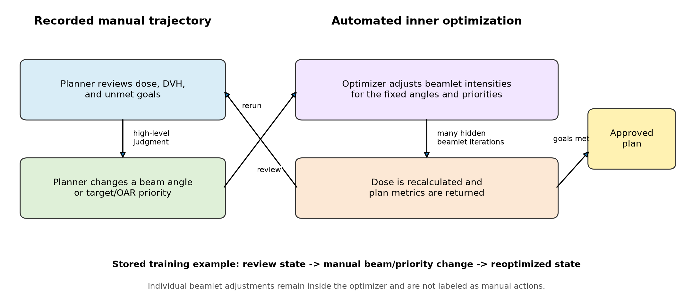
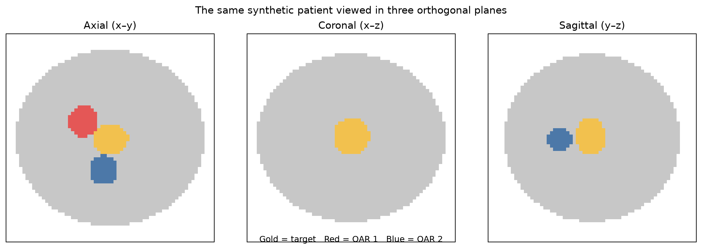

# Do planning trajectories provide information beyond final plans? A controlled simulation study of process supervision in radiation treatment planning

**Article type:** Research Article (protocol-stage manuscript)

**Short title:** Planning trajectory supervision

**Authors:** David Thomas, [additional authors]

**Affiliations:** [To be completed]

**Corresponding author:** David Thomas, [postal address and e-mail]

**Author contributions:** [To be completed before submission using the CRediT taxonomy.]

**Conflict of interest statement:** [To be completed before submission.]

**Funding:** [To be completed before submission.]

**Acknowledgments:** [To be completed before submission.]

\pagebreak

# Abstract

**Background:** Knowledge-based planning and dose-prediction methods learn principally from approved plans and final dose distributions. These endpoints do not preserve the sequence of beam-geometry and optimization-priority changes used to obtain an acceptable plan. It is therefore unknown whether planning trajectories provide useful supervisory information beyond the final plan itself.

**Purpose:** To determine, in a controlled three-dimensional simulation, whether supervision from intermediate high-level planning decisions improves learned planning performance relative to supervision from matched final plans alone.

**Methods:** Synthetic cases will contain one target, one to three organs at risk (OARs), a body contour, a prescription, and case-specific planning limits. Dose will be computed with a deterministic differentiable surrogate that maps beam fluence to a three-dimensional dose field. Planning will be represented by two nested processes. An automated inner optimizer will determine beamlet fluence for fixed beam angles and objective priorities. A manual-level outer process will modify only beam angles or target, hot-spot, and named-OAR priorities. A bounded high-level search procedure will generate one accepted demonstration trajectory for each retained case. The primary experiment will compare two policies with identical architecture, cases, initialization, final-plan targets, training budget, and inference budget. The endpoint-only policy will receive loss terms derived from the final demonstration plan. The trajectory-supervised policy will receive the same final-plan losses plus intermediate state and action targets. Ten independent training seeds will be evaluated on fixed in-distribution and out-of-distribution test sets. The primary endpoint will be paired normalized objective regret relative to a fixed reference optimizer. Secondary endpoints will include acceptable-plan rate, target and OAR metrics, sample efficiency, number of high-level actions, and inference time.

**Results:** [To be completed after the environment, demonstration generator, model specification, and analysis code have been frozen. The abstract will report the paired mean difference in normalized regret with a 95% confidence interval, seed-level replication, acceptable-plan risk difference, out-of-distribution performance, and computational cost.]

**Conclusions:** [To be completed after the prespecified analysis. A favorable result will support the presence of useful supervisory information in planning trajectories within this synthetic environment. A null result will indicate that the evaluated trajectory representation did not improve performance beyond matched endpoint supervision. Neither result will establish clinical efficacy.]

**Keywords:** radiation treatment planning; inverse planning; process supervision; imitation learning; knowledge-based planning; synthetic data

# 1. Introduction

Radiation treatment planning is a sequential decision process. A planner selects or revises beam geometry, specifies target and OAR priorities, reviews the optimized dose distribution, and modifies the problem until the plan satisfies clinical and technical requirements. The approved plan preserves the terminal beam configuration, fluence, and dose, but it generally does not preserve rejected configurations, intermediate dose distributions, or the order in which planning priorities were revised.

Knowledge-based planning and learned dose prediction have demonstrated that prior approved plans contain substantial information about the relationship between anatomy and achievable dose.1–4 These methods commonly estimate dose-volume objectives, predict three-dimensional dose, or produce a terminal plan from patient geometry. Their training targets are predominantly final products. Consequently, an endpoint dataset cannot directly identify which intermediate observations prompted a planner to change an OAR priority, alter target coverage emphasis, or revise beam geometry. The missing information may be redundant with the endpoint, or it may constrain the planning policy in a manner that improves generalization and reduces the number of examples required for training.

This distinction can be tested without acquiring clinical trajectories. A synthetic environment permits exact control over the case distribution, final demonstration plans, state representation, action vocabulary, optimization budget, and evaluation function. It also permits paired construction of two data views from the same demonstrations: an endpoint view containing the initial problem and final accepted plan, and a trajectory view containing the same information plus the intervening states and high-level actions. The resulting comparison isolates the contribution of intermediate supervision more directly than a comparison between unrelated planning systems.

The study is designed to answer one question: when final demonstration plans are held constant, does supervision from intermediate planning states and high-level decisions improve learned planning relative to final-plan-only supervision? The experiment does not evaluate a treatment planning system for clinical use. The dose operator, anatomy, constraints, and planner are synthetic. The intended inference is limited to whether the specified trajectory representation contains measurable information beyond matched endpoints in a controlled planning problem.

# 2. Materials and Methods

## 2.A. Study design and prespecified hypothesis

This will be a paired simulation study. Each generated case will have one initial planning state, one retained demonstration trajectory, and one final demonstration plan. Two training views will be derived from that record. The endpoint-only condition will expose the case, initial state, and final plan. The trajectory-supervised condition will expose these same data and the ordered intermediate state-action transitions. The primary learners will have the same architecture, parameter count, initialization schedule, rollout limit, final-state losses, and training-compute budget.

The prespecified primary hypothesis is that the trajectory-supervised policy will have lower mean normalized objective regret than the endpoint-only policy on the fixed in-distribution test set. Four conditions will be required for a favorable primary interpretation: the 95% confidence interval for the paired mean regret difference must exclude zero in favor of trajectory supervision; the direction of improvement must occur in at least eight of ten training seeds; acceptable-plan rate must not decrease; and either out-of-distribution regret or sample efficiency must improve without a material increase in inference cost.

## 2.B. Synthetic case generation

Each case will be defined on a cubic voxel grid and will contain a body mask, one planning target volume (PTV), and one to three OARs. Structures will be generated from parameterized three-dimensional ellipsoids with bounded perturbations in center, orientation, and principal-axis length. The generator will control target–OAR separation, partial overlap, number of OARs, and usable beam-angle restrictions. Invalid geometries, including structures outside the body and targets below a minimum volume, will be rejected before trajectory generation.

The development grid will contain 64 × 64 × 64 voxels. The primary environment will contain 96 × 96 × 96 voxels. A prespecified resolution analysis will use 128 × 128 × 128 voxels. The primary beam set will contain 12 coplanar candidate gantry angles with a 16 × 16 fluence map per beam. Noncoplanar actions will not be included in the primary experiment. They may be evaluated subsequently as a distinct distribution shift.

Cases will be assigned to easy, moderate, and hard strata. Easy cases will have separated PTV and OAR volumes. Moderate cases will contain close proximity or limited overlap. Hard cases will contain greater overlap, three competing OARs, or restricted beam-angle subsets. Geometry parameters, random seed, generator version, planning goals, and all rejection reasons will be stored.

## 2.C. Three-dimensional dose surrogate

For beam b, the fluence map x_b(u,v) will be sampled in beam’s-eye coordinates after rotating each body voxel into the coordinate system of the beam. Bilinear interpolation in the fluence plane, multiplication by a deterministic depth-attenuation term, and summation over active beams will produce the dose field d(r):

d(r) = Σ_b m_b K_b[x_b](r),

where m_b is the binary active-beam indicator and K_b is the linear beam operator. A mathematically matched adjoint K_b* will propagate a voxelwise objective gradient to the fluence pixels. Forward–adjoint consistency will be verified numerically by the inner-product identity ⟨Kx,y⟩ = ⟨x,K*y⟩.

The operator will be evaluated implicitly; a dense voxel-by-beamlet influence matrix will not be stored. At 96³ resolution with 12 beams and 16 × 16 fluence pixels per beam, a dense float32 matrix would require approximately 10.1 GiB for one case. The implicit representation permits batched execution while maintaining float32 accumulation for plan metrics. The model approximates spatial deposition and attenuation but does not represent clinical radiation transport, heterogeneity correction, multileaf collimator mechanics, or deliverability.

## 2.D. Objective function and plan acceptability

For fixed planning priorities w, the automated optimizer will minimize

J(x;w) = w_cov L_cov + w_hot L_hot + Σ_k w_OAR,k L_OAR,k + w_1 ||x||_1 + w_smooth L_smooth,

where L_cov combines mean squared PTV underdose below prescription with a lower-tail term evaluated on the 10% most underdosed target voxels, L_hot is mean squared PTV overdose above the hot-spot reference, L_OAR,k is mean squared excess dose above the limit for OAR k, ||x||_1 penalizes total fluence, and L_smooth penalizes differences between neighboring fluence pixels. The lower-tail term aligns numerical optimization with the D95 acceptance metric while retaining a differentiable voxelwise objective. All terms will be normalized so that their scales remain comparable across cases. The objective and every component will be recomputed from saved records as a validation check.

The provisional acceptance criteria are PTV D95 at least 0.85 times prescription, PTV D02 at most 1.25 times prescription, and mean dose to every OAR no greater than its stored synthetic limit. These thresholds are engineering values rather than clinical constraints. They will be calibrated using cases excluded from learner comparison and frozen with environment version 1.0. The final criteria and their calibration distributions will be reported before learner training.

## 2.E. Nested planning process

The simulator separates automated numerical optimization from recorded manual-level planning. For fixed active beam angles and fixed priority values, the inner optimizer updates all active fluence maps by projected gradient descent or an equivalently validated differentiable optimizer. Nonnegative fluence is enforced after every update. Inner iterations are not planning actions, are not exposed as behavior labels, and will not be counted as trajectory length.

After the inner optimizer has converged or reached its fixed iteration limit, the outer process reviews the optimized state. A state contains anatomy masks, prescription and limits, active beam indicators, target and OAR priority values, optimized dose, fluence, D95, D02, OAR mean-dose ratios, violation maps, action history, and remaining action budget. The high-level action vocabulary is restricted to the following operations:

1. add one candidate beam angle;
2. remove one active beam angle;
3. increase or decrease target-coverage priority;
4. increase or decrease target hot-spot priority;
5. increase or decrease the priority of one named OAR; or
6. stop and accept the current plan, permitted only when all acceptance criteria are satisfied.

Each priority action applies a discrete multiplicative increment selected before dataset generation. Each beam action modifies one binary angle indicator. The inner optimizer is then rerun, and the resulting optimized state is recorded. Thus, one trajectory transition represents one interpretable change to beam geometry or a named planning priority followed by automated reoptimization.

**Figure 1.** Nested planning process. Recorded supervision is confined to beam-angle and target/OAR-priority decisions in the outer process. Fluence updates occur in the automated inner optimizer and are excluded from manual-action labels.

## 2.F. Demonstration generator and reference optimizer

A deterministic rule-based planner will provide an interpretable baseline. It will select an action from the largest current target or OAR violation using prespecified decision rules and deterministic tie breaking. It will not serve as the primary demonstration source.

Primary demonstrations will be generated by a two-stage bounded high-level search over the same action vocabulary. A routine search with a limited depth and beam width will be applied to every case. A prespecified deeper search will be applied only when the routine search fails and the independent reference optimizer indicates that the case is reachable. At each search depth, candidate beam or priority changes will be applied, the inner optimizer will be run, and a priority-independent violation score will be evaluated. Beam search will retain a fixed number of candidate sequences. The first sequence satisfying all acceptance criteria will be stored. If neither stage finds an acceptable sequence, the case will be labeled not reached by search. This label will not be interpreted as physical infeasibility.

A separate continuous reference optimizer will estimate the best objective attainable under the fixed dose surrogate and case definition. It will provide the denominator for normalized regret and will identify demonstration plans that are materially inferior to the attainable solution. Learners will not be trained on the reference optimizer’s search history. A case will be retained only if its demonstration is acceptable and its terminal objective is within a frozen tolerance of the reference result.

**Figure 2.** Illustrative synthetic three-dimensional case shown in orthogonal planes. This figure documents the geometry representation and is not a study result.

## 2.G. Dataset construction and partitioning

The planned dataset contains 10,000 valid cases: 7000 training cases, 1000 validation cases, 1000 in-distribution test cases, and 1000 out-of-distribution test cases. The in-distribution partitions will be stratified by difficulty. Partition assignment occurs before trajectory generation, and all records derived from a case remain in one partition. The existing split manifest has SHA-256 digest c9af78cd282846ee1410f9f688bbb3cb1b82294009560374e6b331310e269a2b.

The out-of-distribution partition will contain prespecified shifts in target–OAR overlap, OAR count, objective-weight distribution, and available beam angles. The precise parameter ranges will be frozen before generation. Nested training subsets of 100, 250, 500, 1000, 2500, 5000, and 7000 cases will be used for the sample-efficiency analysis.

Each record will contain case identity, generator and optimizer versions, random seeds, geometry parameters, initial state, ordered high-level transitions, final demonstration state, reference result, stopping reason, and per-state quality metrics. The endpoint data loader will be tested to ensure that intermediate states and actions cannot be accessed.

## 2.H. Learned planning policies

The primary model will be an iterative policy πθ(a_t|c,s_t), where c denotes fixed case data and s_t denotes the current optimized planning state. A three-dimensional convolutional encoder will process structure masks, dose, and violation maps. A multilayer perceptron will process scalar metrics, priority values, active-beam indicators, and remaining action budget. The representations will be combined to score all legal high-level actions. Illegal actions, including removal of an inactive beam or reduction below a priority bound, will be masked identically in both conditions.

The endpoint-only policy will be unrolled for the same number of high-level steps as the trajectory-supervised policy. Its loss will contain terminal dose distance, terminal objective, and constraint-violation terms. No intermediate demonstration state or action will be available to this condition.

The trajectory-supervised policy will use the identical network and terminal losses. Additional terms will include categorical action loss at each demonstration state and, if retained after the model pilot, a next-state dose-change loss. The relative trajectory-loss coefficient will be selected using the validation partition and frozen before test evaluation. During rollout, the stop action will be masked until the current plan satisfies the same visible acceptance criteria used to label demonstrations. Both policies will use the same optimizer-update budget. A complementary equal-label analysis will subsample trajectory targets to separate temporal information from target count.

## 2.I. Comparators and ablations

The principal comparison is trajectory-supervised versus endpoint-only iterative planning. Contextual comparators will include the unmodified initial plan, a direct endpoint regressor, the rule-based high-level planner, the demonstration search procedure, and the continuous reference optimizer.

Prespecified ablations will evaluate action labels without next-state targets, intermediate-state targets without action labels, shuffled trajectory order, retention of every second, fifth, or tenth action, 5%, 10%, and 20% suboptimal-action contamination, multiple near-optimal demonstrations, equal optimizer updates, equal numbers of labeled targets, and removal of violation maps. A delivery-complexity analysis will compare the primary 12-angle static representation with 180-degree and 360-degree arc-like angular sampling. These arc-like conditions will assign an independent fluence map to each control point and therefore will not be described as delivery-realistic VMAT; they omit MLC-aperture continuity, cumulative monitor units, dose-rate modulation, and gantry-speed constraints. Shuffled-order and equal-compute analyses will be performed irrespective of the primary result because they are required to distinguish temporal information from additional supervision or computation.

## 2.J. Outcomes

The primary endpoint will be normalized objective regret for model q on case i:

R_iq = [J_iq − J_i,ref] / max(|J_i,ref|, ε),

where J_i,ref is the fixed reference objective and ε prevents numerical instability near zero. The primary effect estimate will be the paired case-level difference R_i,traj − R_i,end. Negative values favor trajectory supervision.

Secondary outcomes will be acceptable-plan rate; PTV D95 and D02; each OAR mean-dose ratio and violation magnitude; number of high-level steps to acceptability; accepted objective improvement per action; inference time; and number of dose evaluations. Sample efficiency will be summarized with learning curves and the number of endpoint-only cases required to match the trajectory-supervised policy trained on 1000 cases.

## 2.K. Statistical analysis

The test case will be the unit of analysis. Both policies will be evaluated on identical cases, and all effect estimates will be paired. Ten model-initialization seeds will be used for each primary condition. Continuous outcomes will be summarized by mean, median, interquartile range, and 95% confidence interval. A hierarchical bootstrap will resample training seeds and cases to obtain confidence intervals that reflect both sources of variation. The acceptable-plan endpoint will be reported as a paired risk difference with a 95% confidence interval.

The single prespecified primary comparison will not receive a multiplicity adjustment. Secondary and ablation comparisons will be controlled with the Benjamini–Hochberg false-discovery-rate procedure. Exact confidence intervals and effect sizes will be reported with P values. Failed runs, search failures, nonfinite values, and all exclusions will remain in the analysis manifest.

No formal power calculation is available for the synthetic effect because a defensible variance estimate does not yet exist. The 1000-case in-distribution test set provides narrow case-level uncertainty for moderate paired effects, whereas ten training seeds characterize training variability. Before the main run, a 300-case learner pilot confined to training and validation partitions will estimate variance and produce a blinded precision analysis without testing the primary hypothesis. Dataset size will not be reduced on the basis of favorable interim effects.

## 2.L. Validation gates and criteria for initiating the main computation

The main 10-seed experiment will begin only after four gates have been satisfied. Environment validation requires dose nonnegativity, forward–adjoint agreement, exact transition replay, objective reproduction, monotonic responses to controlled priority changes, and seed-level reproducibility. Demonstration validation requires at least 95% acceptance among retained in-distribution cases, a frozen demonstration-to-reference tolerance, and documented stopping reasons. Comparison validation requires identical partitions, seed schedules, parameter counts, action masks, rollout limits, and compute budgets, together with an automated proof that the endpoint loader does not expose intermediate records. Reporting validation requires regeneration of every figure from a single per-case results table and retention of failed runs.

An initial 300-case dataset and model pilot will precede the full computation. Progression will require successful overfitting of 32 cases by both learners, stable optimization without nonfinite losses, a measurable range of case difficulty, acceptable throughput on the available hardware, and completion of all comparison-integrity tests. Failure of a gate will trigger revision and regeneration of pilot data; it will not trigger expansion to the full dataset.

## 2.M. Computational implementation and reproducibility

The dose operator and learned models will be implemented in Python and PyTorch. Independent cases will be distributed across four NVIDIA A100 graphics processing units for dataset generation and training. Mixed-precision beam calculations may use float16 or bfloat16, while objective accumulation and reported metrics will use float32. Configuration files, package versions, source-control commit, random seeds, dataset hashes, checkpoints, and per-case outputs will be archived. Unit tests will cover geometry, forward and adjoint operators, NumPy–PyTorch agreement, inactive-beam masking, action transitions, objective components, serialization, and data-view separation.

The current local implementation has completed engineering verification at 64³ through 256³ resolution and passes the available automated tests with a CUDA backend. These measurements are excluded from the planned hypothesis test. Formal computational results will be regenerated from the frozen version and reported in Section 3.

## 2.N. Scope and ethics

The study uses generated geometries and synthetic constraints. It contains no patient information, clinical plans, or human participants. Institutional review requirements will be confirmed before any later study using clinical planning trajectories. The present study will not support conclusions regarding clinical plan quality, patient safety, deliverability, or superiority to a treatment planning system.

# 3. Results

## 3.A. Environment and demonstration validation

[RESULTS PLACEHOLDER. Report Gate A test results; generated, rejected, search-failed, and retained case counts; acceptance rate with confidence interval; trajectory-length distribution; difficulty balance; and demonstration-to-reference objective difference. Insert the environment-validation table and representative non-result methods images only after the environment version is frozen.]

## 3.B. Primary in-distribution comparison

[RESULTS PLACEHOLDER. Report normalized regret for both conditions across 1000 paired cases and ten seeds; paired mean difference with hierarchical-bootstrap 95% confidence interval and P value; median paired difference; fraction of seeds favoring trajectory supervision; and the full distribution of case-level differences.]

## 3.C. Plan acceptability and dosimetric components

[RESULTS PLACEHOLDER. Report paired acceptable-plan counts and risk difference; PTV D95 and D02; each OAR mean-dose ratio; violation magnitudes; and the number of cases improved, unchanged, or worsened.]

## 3.D. Sample efficiency

[RESULTS PLACEHOLDER. Report regret and acceptable-plan rate at 100, 250, 500, 1000, 2500, 5000, and 7000 training cases; area under the learning curves; and the endpoint-only sample count required to match the 1000-case trajectory model.]

## 3.E. Out-of-distribution evaluation

[RESULTS PLACEHOLDER. Report the primary and secondary outcomes for each frozen distribution shift, with separate estimates for increased overlap, additional OARs, shifted priorities, and restricted beam angles.]

## 3.F. Ablations and failure analysis

[RESULTS PLACEHOLDER. Report action-only, state-only, shuffled-order, sparse, noisy, diverse-demonstration, equal-update, equal-label, and hidden-rationale analyses. Describe failure modes by difficulty stratum without selecting examples solely by visual appearance.]

## 3.G. Computational performance

[RESULTS PLACEHOLDER. Report dataset-generation throughput, training time, inference time, peak device memory, number of dose evaluations, hardware configuration, and total energy or device-hours if available.]

# 4. Discussion

This study is designed to isolate the value of ordered planning information from the value of a final plan. The two principal conditions use the same cases and terminal demonstrations, and differ only in access to intermediate optimized states and high-level beam or priority decisions. This control is essential because a comparison between independently generated endpoint and trajectory datasets would confound trajectory information with final-plan quality, case selection, or computational budget.

If the trajectory-supervised policy meets the prespecified criteria, the result will indicate that the ordered high-level decisions contain information that is not fully recovered from terminal dose and plan parameters by the evaluated endpoint learner. Improvement in the shuffled-order control would weaken this interpretation by indicating that additional targets, rather than their temporal order, explain the effect. Improvement that disappears in the equal-label or equal-update control would similarly identify supervision quantity or training computation as the operative factor.

A null result would remain informative. It could indicate that the final state is sufficient for the synthetic problem, that the state and action representation omits the relevant decision context, that the demonstration generator is too deterministic, or that the task lacks ambiguity requiring intermediate guidance. These alternatives will be examined through the diverse-demonstration, hidden-rationale, difficulty, and out-of-distribution analyses. A null result would not establish that clinical planning trajectories lack value; it would limit support for the present representation and task.

The study differs from conventional knowledge-based planning and dose prediction. Those approaches estimate achievable objectives or terminal dose from anatomy and prior plans.1–4 The present models instead select a sequence of explicit planning changes, while a fixed numerical optimizer determines fluence after each change. This separation places the learned decision at the level of beam geometry and named priorities. It also prevents numerical optimizer iterations from being mischaracterized as manual behavior.

Sequential supervision introduces a distributional concern: errors early in a rollout change the states encountered later. General imitation-learning theory identifies this dependence as a source of compounding error when a policy is trained only on expert-visited states.5 The primary comparison therefore uses identical rollout budgets, and the failure analysis will distinguish action-classification accuracy at demonstration states from realized closed-loop planning performance. Dataset aggregation or recovery-state training may be evaluated subsequently, but it is not part of the primary contrast.

The principal limitation is the synthetic environment. The dose surrogate omits scattering physics, tissue heterogeneity, delivery constraints, machine limitations, and clinical judgment. The acceptance thresholds do not represent a clinical protocol. The high-level search procedure is an operational demonstration generator, not a model of a dosimetrist. Its failure denotes failure within a search budget rather than infeasibility. Furthermore, one terminal plan may not represent the full set of clinically acceptable solutions. The multiple-demonstration ablation partially addresses this nonuniqueness but cannot reproduce interplanner or interinstitutional variation.

Clinical translation would require a separate observational study in which planning states and actions are extracted from treatment planning sessions, linked to dose and plan revisions, reviewed for semantic validity, and evaluated under institutional governance. Every synthetic state element retained for that study would require a defined clinical source. Screen-observable variables and treatment-planning-system exports may differ in timing and precision. The present study can justify collection of this data modality only if a benefit remains after the matched-compute, matched-label, and shuffled-order controls.

# 5. Conclusions

[CONCLUSION PLACEHOLDER. State whether the prespecified primary criterion was met and identify the result as evidence confined to the frozen synthetic environment. Do not claim clinical benefit. If favorable, specify whether the benefit reflected final quality, acceptable-plan rate, sample efficiency, out-of-distribution performance, or action efficiency. If null, state the confidence interval and the effect sizes excluded by the experiment.]

# Data and code availability

Source code, frozen configurations, split manifests, dataset hashes, and analysis scripts will be made available at https://github.com/davidthomas411/planning-learner-sim. Generated data and model checkpoints will be deposited with the manuscript or in an archival repository, subject to file-size limitations.

# References

1. Momin S, Fu Y, Lei Y, et al. Knowledge-based radiation treatment planning: A data-driven method survey. J Appl Clin Med Phys. 2021;22(8):16–44. doi:10.1002/acm2.13337.

2. Fan J, Wang J, Chen Z, Hu C, Zhang Z, Hu W. Automatic treatment planning based on three-dimensional dose distribution predicted from deep learning technique. Med Phys. 2019;46(1):370–381. doi:10.1002/mp.13271.

3. Nguyen D, Jia X, Sher D, et al. 3D radiotherapy dose prediction on head and neck cancer patients with a hierarchically densely connected U-net deep learning architecture. Phys Med Biol. 2019;64(6):065020. doi:10.1088/1361-6560/ab039b.

4. Barragán-Montero AM, Nguyen D, Lu W, et al. Three-dimensional dose prediction for lung IMRT patients with deep neural networks: robust learning from heterogeneous beam configurations. Med Phys. 2019;46(8):3679–3691. doi:10.1002/mp.13597.

5. Ross S, Gordon GJ, Bagnell JA. A reduction of imitation learning and structured prediction to no-regret online learning. Proc Mach Learn Res. 2011;15:627–635.

6. Appenzoller LM, Michalski JM, Thorstad WL, Mutic S, Moore KL. Predicting dose-volume histograms for organs-at-risk in IMRT planning. Med Phys. 2012;39(12):7446–7461. doi:10.1118/1.4761864.

7. Moore KL, Brame RS, Low DA, Mutic S. Experience-based quality control of clinical intensity-modulated radiotherapy planning. Int J Radiat Oncol Biol Phys. 2011;81(2):545–551. doi:10.1016/j.ijrobp.2010.11.030.

8. Good D, Lo J, Lee WR, Wu QJ, Yin FF, Das SK. A knowledge-based approach to improving and homogenizing intensity modulated radiation therapy planning quality among treatment centers: an example application to prostate cancer planning. Int J Radiat Oncol Biol Phys. 2013;87(1):176–181. doi:10.1016/j.ijrobp.2013.03.015.

# Tables

**Table I. Primary comparison.**

| Design element | Endpoint-only condition | Trajectory-supervised condition |
|---|---|---|
| Cases and partitions | Identical | Identical |
| Initial planning state | Identical | Identical |
| Final demonstration plan | Available | Available |
| Intermediate optimized states | Unavailable | Available |
| High-level beam/priority actions | Unavailable | Available |
| Architecture and parameter count | Identical | Identical |
| Training and rollout budget | Identical | Identical |
| Terminal losses | Identical | Identical |
| Intermediate action/state losses | None | Prespecified |

**Table II. Prespecified outcomes and interpretation criteria.**

| Domain | Measure | Prespecified interpretation |
|---|---|---|
| Primary quality | Paired normalized regret difference | 95% CI excludes zero in favor of trajectory supervision |
| Replication | Seed-level direction | Improvement in at least 8 of 10 seeds |
| Safety analogue | Paired acceptable-plan risk difference | No decrease with trajectory supervision |
| Generalization | OOD regret or sample efficiency | Improvement without material inference-cost increase |
| Mechanism | Shuffled order, equal labels, equal updates | Benefit persists when target count and compute are controlled |

**Table III. Primary results shell.**

| Outcome | Endpoint only | Trajectory supervised | Paired effect (95% CI) | P value |
|---|---:|---:|---:|---:|
| IID normalized regret | [ ] | [ ] | [ ] | [ ] |
| Acceptable-plan rate | [ ] | [ ] | [ ] | [ ] |
| PTV D95 | [ ] | [ ] | [ ] | [ ] |
| PTV D02 | [ ] | [ ] | [ ] | [ ] |
| OAR violation magnitude | [ ] | [ ] | [ ] | [ ] |
| High-level actions | [ ] | [ ] | [ ] | [ ] |
| Inference time | [ ] | [ ] | [ ] | [ ] |

**Table IV. Precomputation progression gates.**

| Gate | Required evidence before full computation |
|---|---|
| Environment | Nonnegative dose; forward–adjoint agreement; transition replay; objective reproduction; controlled priority response; exact seed reproduction |
| Demonstrations | At least 95% acceptance among retained IID cases; frozen reference tolerance; complete failure manifest |
| Learners | Both conditions overfit 32 cases; stable losses; comparable throughput; fixed hyperparameters |
| Comparison | Identical cases, seeds, parameters, action masks, rollout and compute; endpoint loader isolation test passes |
| Reporting | Per-case results table regenerates all planned figures; exclusions and failed runs retained |
